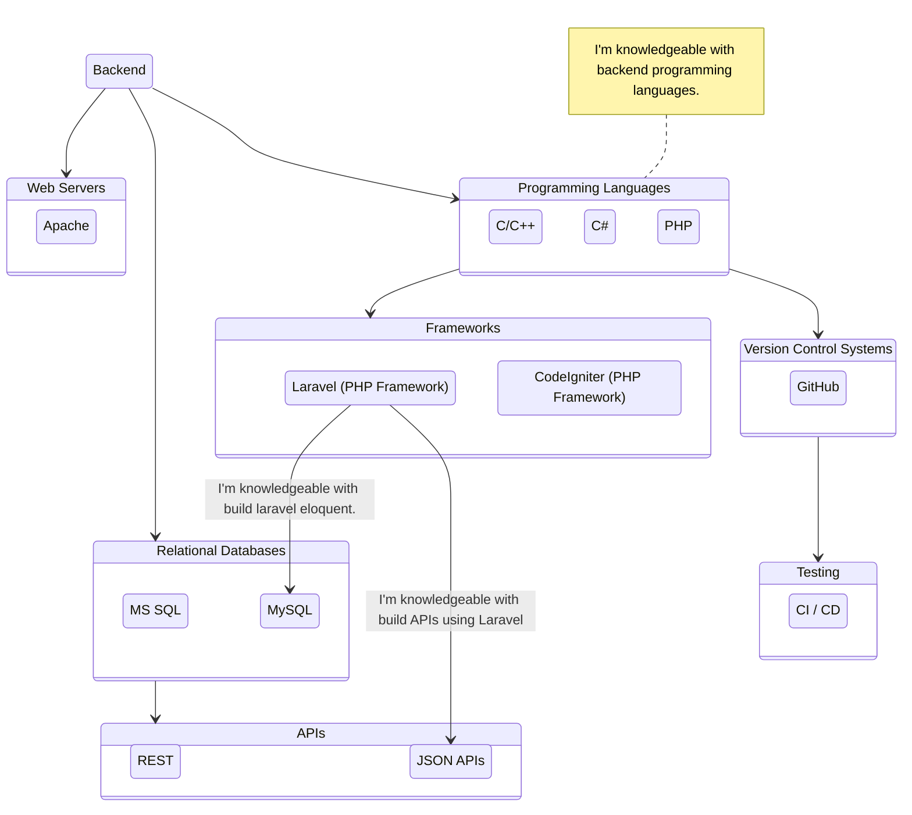
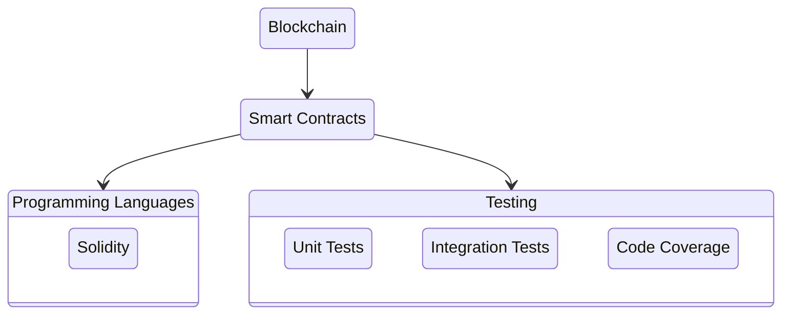
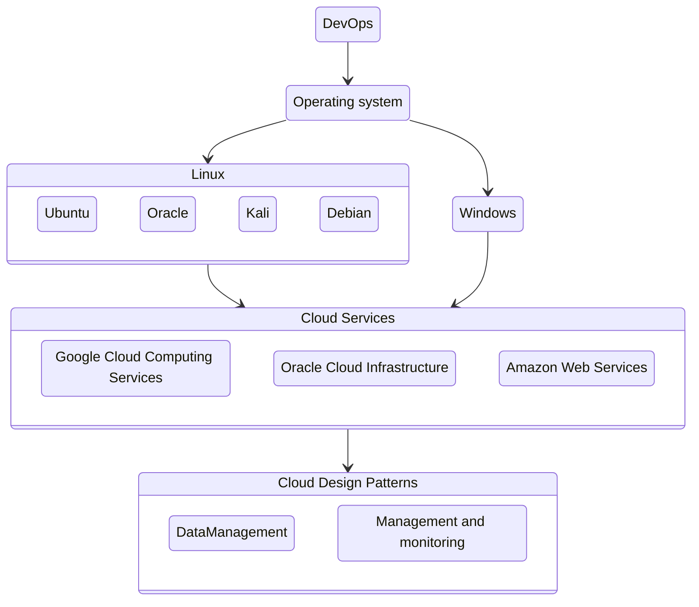

# My Roadmap to Becoming a Full Stack Developer: My Skill Trees

> - [C Developers Guide](../../../C-Developer-s-Guide)
>   - [Beginners](../../../C-Developer-s-Guide/tree/beginners)

> - [JavaScript Developers Guide](../../../JavaScript-Developer-s-Guide)
>   - [Beginners](../../../JavaScript-Developer-s-Guide/tree/anvanced)

> - [TypeScript Developers Guide](../../../TypeScript-Developer-s-Guide)
>   - [Beginners](../../../TypeScript-Developer-s-Guide/tree/beginners)

> - [React Examples](../../../react-examples)
>   - [Components: Popup](../../../react-examples/tree/components/popup)

> - [Solidity Developers Guide](../../../Solidity-Developer-s-Guide)
>   - [Beginners](../../../Solidity-Developer-s-Guide/tree/beginners)

## My Roadmap to Becoming a Full Stack Developer: My Projects

> - [Laravel 9 & React & TypeScript with CRM Project](../../../fnsoftworks-web-app)
> - [React & TypeScript with Ethereum dApp Project](../../../nft-minting-collection-app)
> 

I believe Open Source is for EVERYONE, yes YOU TOO! Join me on my <a href="https://www.youtube.com/channel/UC7edB0EhgVO7dAVY8-NiVTA?sub_confirmation=1">YouTube channel</a>

<b>Join our inclusive community <a href="http://community.farunurisonmez.com">FNS Community</a>!</b> Coming Soon

<h5 align="center">Would you like to donate to our community?</h5>

Sign up to my community <a href="http://farunurisonmez.com/newsletters">FNS Newsletter</a> to be kept up-to-date monthly with upcoming events, community achievements and more

  
   
  
   

  
  
  

